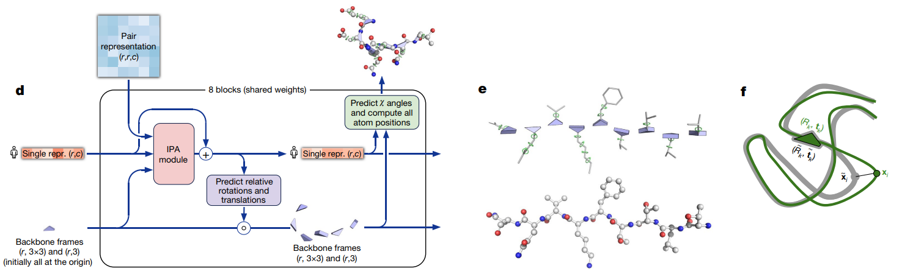

# Pytorch Implementation of Alphafold2's Structure Module 

# Introduction

This is the Pytorch implementation of the structure module of Alphafold2 [1].
    
You can leverage this implementation to:

- understand the architecture of the structure module. Be sure also read the Alphafold2 supplement.
- incoorporate the structure module into your own model. All code is tested. 
- customize the structure module to your own needs. E.g., design a structure module for RNA structure prediction. See the examples.

# Install 


```bash
git clone https://github.com/pengzhangzhi/protein_structure_module_of_AF2.git
```
```bash
cd protein_structure_module_of_AF2
```

```python
pip install .
```


# Usage


# References

[1] Jumper, J., Evans, R., Pritzel, A. et al. Highly accurate protein structure prediction with AlphaFold. Nature 596, 583–589 (2021). https://doi.org/10.1038/s41586-021-03819-2

